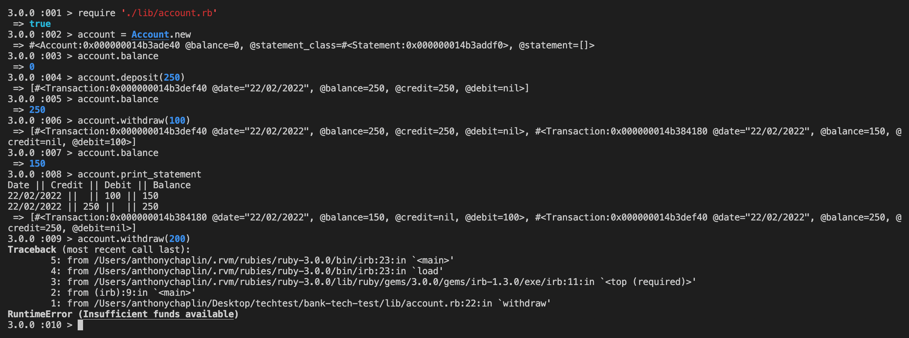
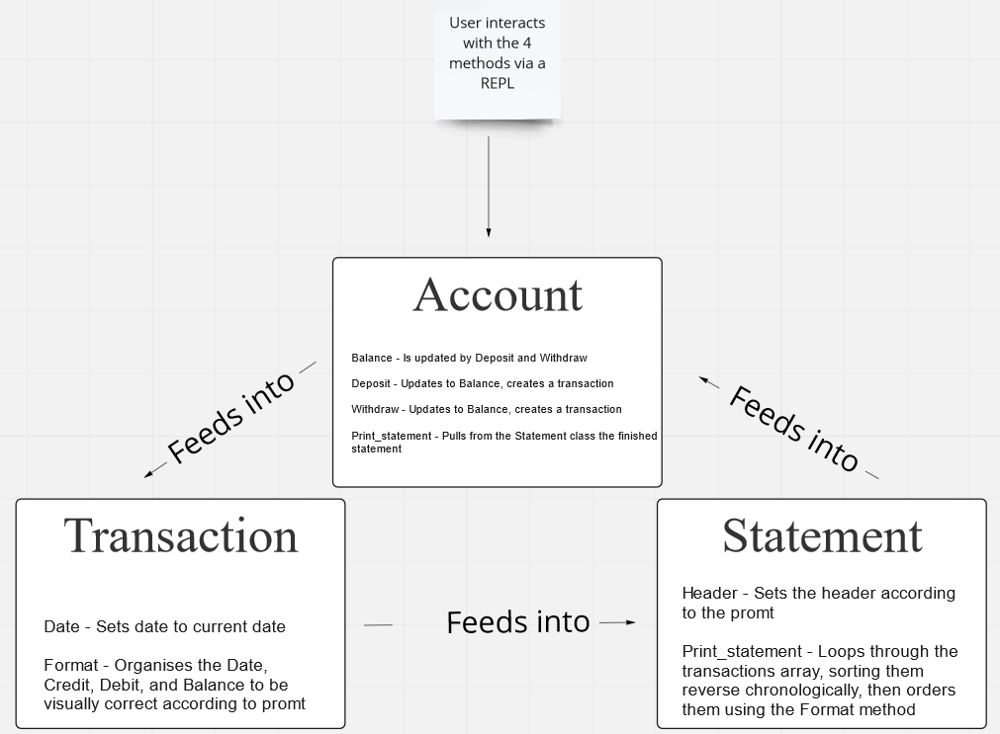

# Bank-Tech-Test

This is a tech test for Maker's Academy

### How to use
Fork the repo, then follow the below:
```
> bundle install
> irb # Or your preferred repl
> require './lib/account.rb'
> account = Account.new
```
With the ruby file loaded, you can use the following commands:
```
account.balance # shows the current account balance
account.deposit(amount) # deposits the amount given in brackets
account.withdraw(amount) # withdraws the amount given in brackets
account.print_statement # will print a statement showing you your transactions in reverse chronological order
``` 


# 

Error is generated when trying to withdraw more than your total balance

### Running tests
cd into the directory from your terminal
On your terminal run:
```
> rspec
```

User stories:
```
As a money conscious person
So I can keep track of my funds
I want to be able to see my balance
```
```
As a prodigious saver of money
So I can make sure I'm saving enough
I want to see my deposits
```
```
As an enthusiastic shopper
So I can make sure I don't over-spend
I want to see my withdrawals
```
```
As a responsible individual
So I can make sure my bills and payslips are correct
I want to see the date of my deposits and withdrawals
```
```
As a responsible bank
So we can prevent people taking out more than they have
We want to raise an error if someone tries to withdraw more than their balance
```
```
As a customer of the bank
So I can review all my transactions
I want to see my printed bank statement
```

### Approach

I started with a Diagram to outline how I generally wanted the test to be, including the three classes and how they would interact at a basic level. I then moved through my user stories, attempting to TDD as much as possible, and linted with Rubocop as I went. Once I was happy, I looked through my Simplecov coverage to bring my test coverage up, then ran Rubocop one final time.

### Diagram

# 
